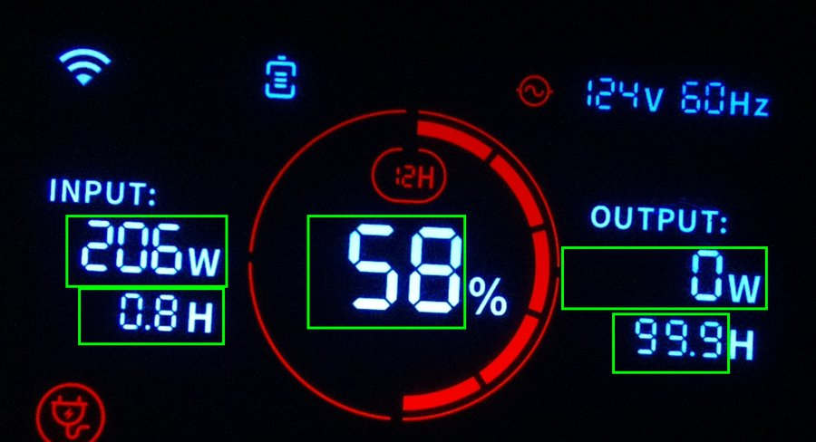

# Jackery display reader

Read a Jackery Explorer 300 Plus front panel with a Raspberry Pi camera and Tesseract —
locally, with no app, no cloud and no Bluetooth.



It reads five fields from each photo:

| field | example above |
|---|---|
| state of charge | 58 % |
| input watts | 206 W |
| time to full (only while charging) | 0.8 H |
| output watts | 0 W |
| time to empty | 99.9 H (shown while charging) |

## Why

Written to keep the battery's state of charge visible during a power outage, when the
Jackery app is no use: its readings go through Jackery's cloud, and its Bluetooth
connection can stop working for days. The same approach should suit anyone who wants a
power station on a local dashboard, or who wants to read any seven-segment display with a
fixed camera.

## How well it works

A 2-hour run on 2026-10-08, one photo a minute, through idle, an 80 W load (84 % down to
50 %) and a recharge back to 85 %: **one wrong value in 670 readings** (output 81 read as
811) and three blank reads. Details, and how it got there, in
[`docs/ocr_results.md`](docs/ocr_results.md).

## Hardware

- Raspberry Pi 3 Model B (anything that runs Tesseract will do; it takes about 0.4 s per
  field on a 3B).
- Raspberry Pi Camera Module v2.1 (IMX219). It ships focused for 1 m and beyond; its lens
  was turned about a quarter turn counterclockwise by hand to focus it near 7 cm.
- Camera 7 cm from the display, lens face to display face. Every field read correctly from
  6 to 9 cm.
- A dark room, or a light-tight box. Room light reflected in the display glass makes the
  small fields unreadable.

## Software

- Raspberry Pi OS (tested on Debian 13 trixie, 64-bit), with `rpicam-apps`.
- `tesseract-ocr` and `python3-pil` from apt.
- The `7seg` Tesseract model from
  [Shreeshrii/tessdata_ssd](https://github.com/Shreeshrii/tessdata_ssd), saved as
  `tessdata/7seg.traineddata` in this repo.

## Use

Take a photo with fixed exposure (automatic exposure blurs the lit segments together):

```
rpicam-still -n -t 800 --rotation 180 --shutter 50000 --gain 4 --awbgains 1.5,1.5 -o photo.jpg
```

Read it:

```
python3 src/read_fields.py photo.jpg
```

Output is CSV, one row per photo. A blank field means not shown or not read; a field
starting with `?` means Tesseract returned something that is not a number.

## How it works

All in [`src/read_fields.py`](src/read_fields.py), about 100 lines of Pillow:

1. **Find the display.** The lit segments are the only blue things in the photo; their
   outline gives the display's position and size. The boxes are shifted and scaled to
   match, so a bumped camera or a change of distance does not break them.
2. **Crop each field and make the segments solid.** Threshold on the green channel: the
   segments' centres are near-white and their glow is pure blue, so green picks out the
   segments without the glow.
3. **Scale each crop to one size**, thicken the segments by a pixel, and run Tesseract
   with the `7seg` model.
4. **Fix letters read for digits** (O → 0, G → 6 and so on) and keep the leading number.

Things that mattered, found by testing:

- Leaving the unit letter (H) out of the time-to-empty box. With it, "1.8H" read as "LOH".
- Focus. At 10 cm, 3 cm past the lens's focus, the time-to-empty 8 read as 9 in one photo
  in ten.

The boxes are for the Explorer 300 Plus. Another model needs its own boxes; the method
carries over.

## Prior art

[philippbussche/jacktessery](https://github.com/philippbussche/jacktessery) reads an
Explorer 1000 Pro the same way, with an ESP32-CAM and a Flask server. Its approach —
Pillow, a tight box per field and the seven-segment Tesseract models — is the starting
point here.

## Status

Reading works. Not yet built: the light-tight enclosure, checks that reject impossible
readings, and the link into the logger of the parent project that uses the readings.

## License

MIT — see [LICENSE](LICENSE). The Jackery user manual is not included; see
[`docs/reference/README.md`](docs/reference/README.md).
